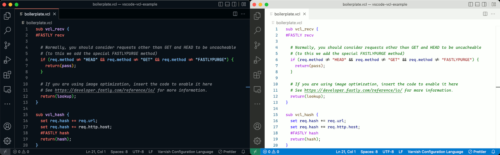

# vscode-vcl


A Visual Studio Code extension which adds syntax highlighting for Fastly Varnish Configuration Language (VCL) files.



## Features

This uses a JSON [TextMate language grammar](https://macromates.com/manual/en/language_grammars): [syntaxes/vtc.tmLanguage.json](syntaxes/vtc.tmLanguage.json), a structured collection of regular expressions, to tokenize the text into scopes. Visual Studio Code themes map scopes to colours and styles.

This was built entirely from the public [VCL reference](https://developer.fastly.com/reference/vcl/).

The screenshots above are of [VCL boilerplate](https://developer.fastly.com/learning/vcl/using/#adding-vcl-to-your-service-configuration) using the [GitHub Dark Default](https://marketplace.visualstudio.com/items?itemName=GitHub.github-vscode-theme) theme and the [JetBrains Mono](https://www.jetbrains.com/lp/mono/) font and using Visual Studio Code's default Light+ theme and the [Cascadia Code](https://github.com/microsoft/cascadia-code) font.

## Installation

Uninstall any previously-enabled VCL extensions.

Download the [latest GitHub release](https://github.com/fastly/vscode-vcl/releases/) and then run:

```bash
code --install-extension vscode-vcl-1.0.1.vsix
```

## Testing

To run the grammar tests:

```bash
npm test
```

The test cases are stored as markdown files under `test/colorize-fixtures`. Grammar test results are stored under `test/colorize-results`, which are automatically generated from the fixtures.

## Requirements

None.

## Extension Settings

None.

## Known Issues

None.

## Release Notes

## [1.0.1] - 2022-09-07

### Added

- Documented that only one VCL extension should be installed.

### Changed

- Tighten up `#FASTLY` macro matching.

## [1.0.0] - 2022-09-06

- Initial release.

---

## TODO

- Syntax highlight VCL embedded into Markdown documents.
- Syntax highlight regular expressions.

## Future

Is this useful? Let me know! Leon Brocard <<leon@fastly.com>>
