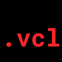
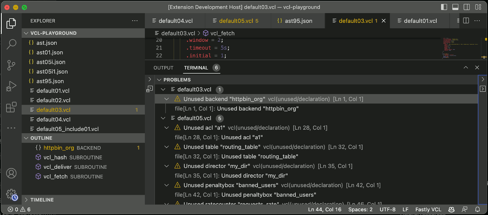
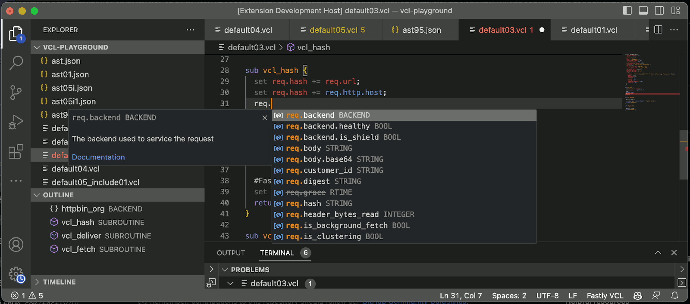
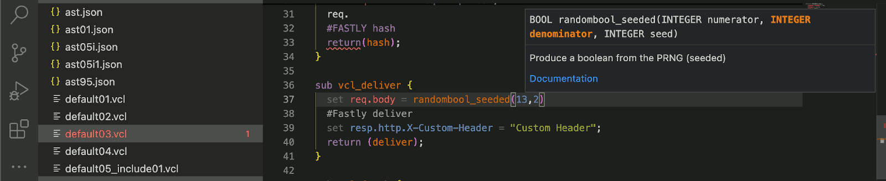
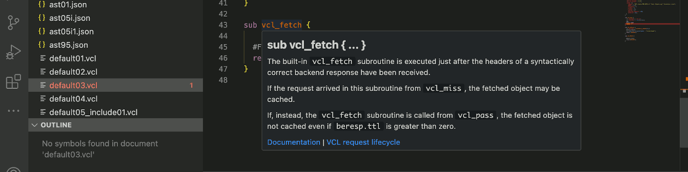
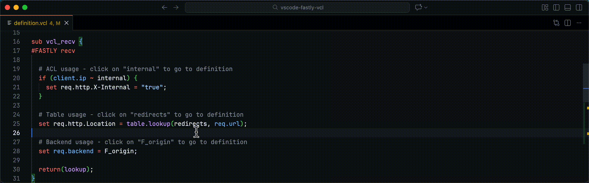
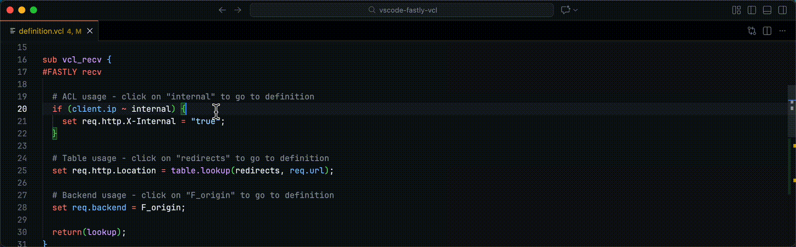

# Fastly Varnish Configuration Language (VCL) Support for Visual Studio Code



A Visual Studio Code extension that adds syntax highlighting, code completion, snippets, documentation and linter diagnostics for Fastly Varnish Configuration Language (VCL) files.

This extension is based on the public [Fastly VCL reference](https://developer.fastly.com/reference/vcl/).


## Features

### Syntax highlighting

The screenshots above are of [VCL boilerplate](https://developer.fastly.com/learning/vcl/using/#adding-vcl-to-your-service-configuration) using the [GitHub Dark Default](https://marketplace.visualstudio.com/items?itemName=GitHub.github-vscode-theme) theme and the [JetBrains Mono](https://www.jetbrains.com/lp/mono/) font and using Visual Studio Code's default Light+ theme and the [Cascadia Code](https://github.com/microsoft/cascadia-code) font.

### Diagnostics (with [`falco`](https://github.com/ysugimoto/falco))



### Contextual completions

Completions include:

- VCL functions
- VCL variables
- HTTP headers
- Subroutine snippets
- Fastly macros



### Signature help



### Documentation on hover



### Go to definition and peek definition

Navigate to the definition of ACLs, tables, backends, local variables, and parameters using Ctrl+Click / Cmd+Click or F12.



Peek at definitions using ⌥F12:



### Find References

Find all references to ACLs, tables, backends, and subroutines using Shift+F12 or right-click and select "Find All References".

### Code Folding

Collapse and expand code blocks for easier navigation. Supported regions include subroutines, ACLs, tables, backends, if/else blocks, and comment blocks.

### Document Highlights

When the cursor is on a symbol, all occurrences of that symbol in the current document are highlighted. Works with ACLs, tables, backends, subroutines, HTTP headers (e.g., `req.http.X-Custom`), and local variables (e.g., `var.count`).

## Installation

### From Marketplace

[The extension](https://marketplace.visualstudio.com/items?itemName=fastly.vscode-fastly-vcl) is in the [Visual Studio Code Marketplace](https://marketplace.visualstudio.com/VSCode). To install in Visual Studio Code, switch to the Extensions View and search for “Fastly”. Select the “Fastly Varnish Configuration Language (VCL)” extension and use the Install button. The extension will syntax highlight code for any file with a .vcl extension.

### From GitHub

Alternatively, to install the extension from GitHub:

Uninstall (or disable) any previously-enabled VCL extensions.

Download the [latest GitHub release](https://github.com/fastly/vscode-fastly-vcl/releases/) and then run:

```bash
code --install-extension vscode-fastly-vcl-2.0.4.vsix
```

## Requirements

[NodeJS](https://nodejs.org) LTS.

## Extension Settings

- `fastly.vcl.lintingEnabled` (default: `true`) – Enables linter diagnostics.
- `fastly.vcl.maxLintingIssues` (default: `100`) - Specifies the maximum number of linting issues that the server will return.
- `fastly.vcl.falcoPath` (default: `""`) - Path to a custom falco binary. If not set, the bundled falco will be used.

## Known Issues

Use our [GitHub issues](https://github.com/fastly/vscode-fastly-vcl/issues/new) to report a problem or request a feature.

## Contributors

Special thanks to all contributors:

- [Dora Militaru](https://github.com/doramatadora)
- [Ed Thurgood](https://github.com/ejthurgo)
- [Hiromasa Kakehashi](https://github.com/hrmsk66)
- [Leon Brocard](https://github.com/acme)

## Future

Is this useful? Let me know! Leon Brocard <<leon@fastly.com>>
